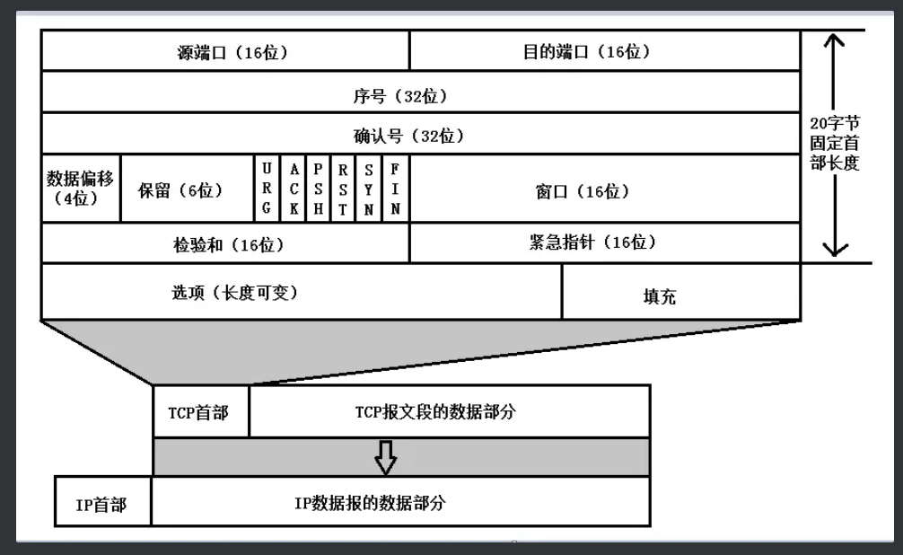
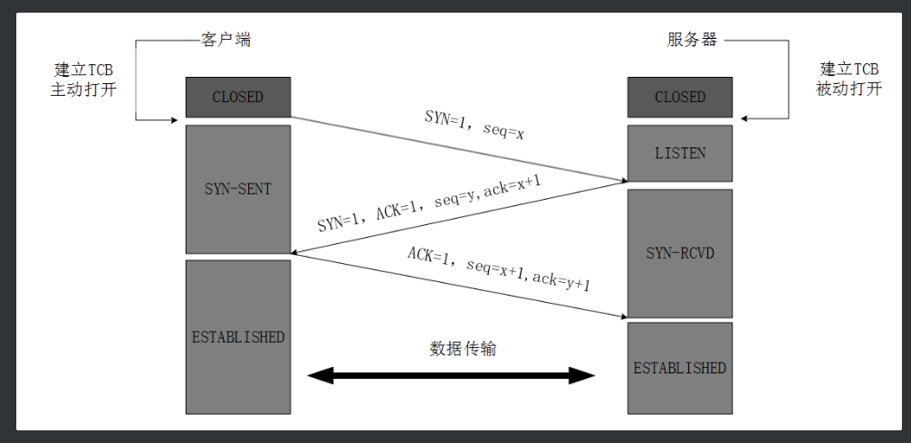
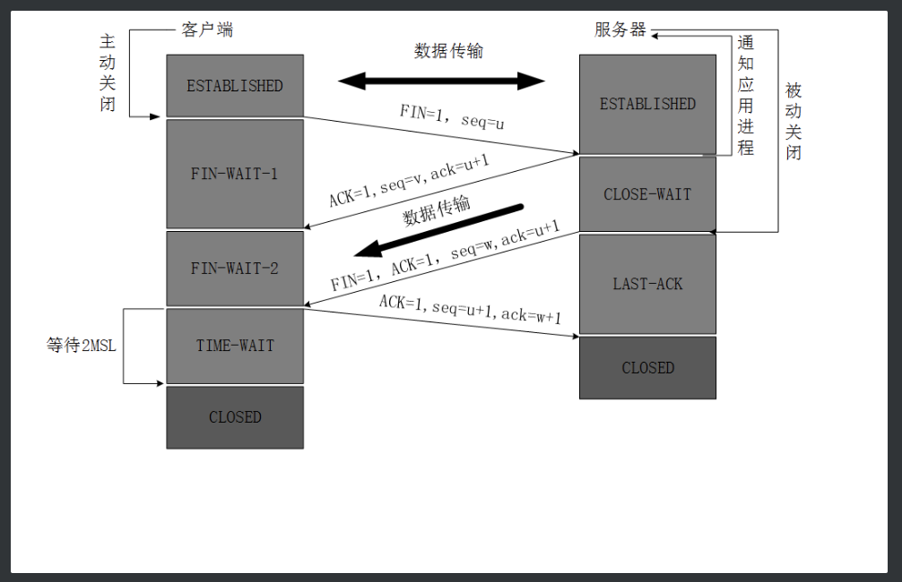
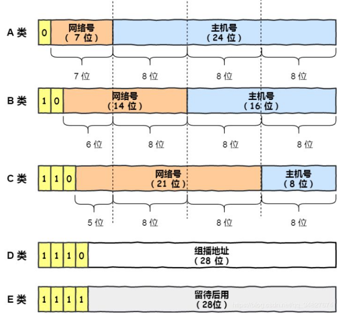
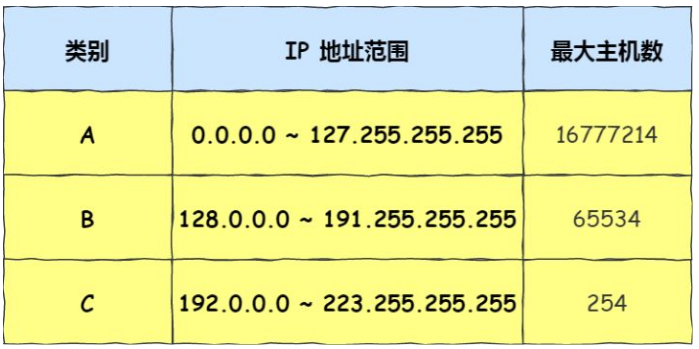
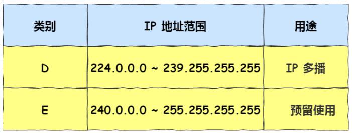
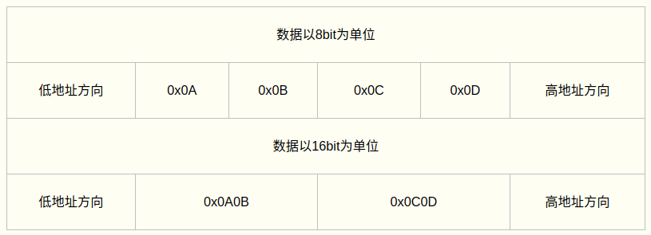
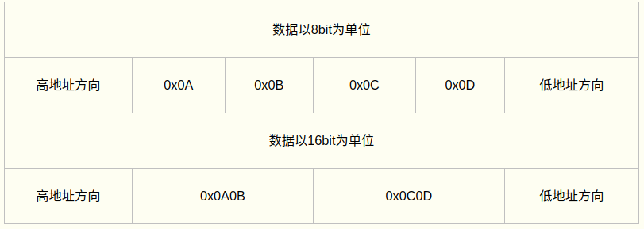

[toc]


# 计算机网络

## 传输层

### TCP协议

TCP是面向链接的，可靠的传输。TCP通过校验和、序列号、确认应答、重发控制、连接管理以及窗口控制等机制来实现可靠传输。

1. TCP报文

   

   - 源端口和目的端口，各占2个字节，分别写入源端口和目的端口
   - 序号(seq)：占四个字节， TCP连接中传送字节流中的每个字节都按顺序编号
   - 确认号(ack): 占4个字节，是期望收到对方下一个报文的第一个数据字节的序号
   - 数据偏移：它指出TCP报文的数据距离TCP报文段的起始处有多远
   - 保留，占6位，保留今后使用，但目前应都位0
   - 紧急URG，当URG=1，表明紧急指针字段有效。告诉系统此报文段中有紧急数据
   - 确认ACK，仅当ACK=1时，确认号字段才有效。TCP规定，在连接建立后所有报文的传输都必须把ACK置1
   - 推送PSH，当两个应用进程进行交互式通信时，有时在一端的应用进程希望在键入一个命令后立即就能收到对方的响应，这时候就将PSH=1
   - 复位RST，当RST=1，表明TCP连接中出现严重差错，必须释放连接，然后再重新建立连接
   - 同步SYN，在连接建立时用来同步序号。当SYN=1，ACK=0，表明是连接请求报文，若同意连接，则响应报文中应该使SYN=1，ACK=1
   - 终止FIN，用来释放连接。当FIN=1，表明此报文的发送方的数据已经发送完毕，并且要求释放
   - 窗口，占2字节，指的是通知接收方，发送本报文段的一方的接受窗口（而不是自己的发送窗口）,窗口大小是给对方用的，窗口字段明确指出了现在允许对方发送的数据量。窗口值经常在动态变化
   - 检验和，占2字节，校验首部和数据这两部分
   - 紧急指针，占2字节，指出本报文段中的紧急数据的字节数
   - 选项，长度可变，定义一些其他的可选的参数
   - 填充：为了对齐？

2. 三次握手

   

3. 四次挥手

   

4. 细节功能

   1. 滑动窗口
   2. 超时重传

## 网络层

网络层的主要作用是实现主机与主机之间的通信，即点对点(end to end)通信。

数据链路层(MAC)的作用实现直连的两个设备之间的通信，而IP则负责在没有直连的两个网络之间进行通信传输。

### IP地址的分类

   

   

最大主机数=2^(主机位)-2。主机号全为1指定某个网络下的所有主机，用于广播。主机号全为0用于指定某个网络。
广播地址用于在同一个链路中共相互连接的主机之间发送数据包。广播无法穿透路由。
   - 本地广播：在本网络内广播
   - 直接广播：在不同网络间广播

   

多播用于将包发送给特定组内的所有主机。多播使用的是D类地址，前四位1110表示多播地址，剩下的28位是多播的组编号。
从224.0.0.0～239.255.255.255都是多播的可用范围，其划分为以下三类：
   - 224.0.0.0～224.0.0.255为预留的组播地址，只能在局域网中，路由器是不会进行转发的。
   - 224.0.1.0～238.255.255.255为用户的组播地址，可用于Internet上
   - 239.0.0.0～239.255.255.255为本地管理组播地址，可供内部网在内部使用，仅在特定的本地范围内有效

### 无分类地址CIDR

由于IP分类具有统一网络下没有地址层次，且不能很好的与现实网络匹配的缺点，所以使用CIDR来解决。
这种方式不再有分类地址的概念，32bit的IP地址被分为网络号，主机号两部分。

```
a.b.c.d/x 其中x表示前x位属于网络号，x的范围为0～32
```

另一种划分网络号和主机号的形式是子网掩码，掩码是指掩盖掉主机号，剩余的就是网络号。**将子网掩码和IP相与就可得网络号**。


### ipv4.VS.ipv6

https://www.ibm.com/support/knowledgecenter/zh/ssw_ibm_i_72/rzai2/rzai2compipv4ipv6.htm

1. IPv4为32bit，IPv6为128bit(64bit网络位，64bit主机位)
2. IPv6减小了路由表的长度，提高了路由器转发数据包的速度
3. IPv6简化了报头格式
4. IPv6的可选项不放入报头，而是放在一个个独立的扩展头部，如果不指定路由器不会打开处理扩展头部，还放宽了对可选项长度的严格要求(IPv4的可选项总长最多为40字节)，可根据需要随时引入新选项。
5. IPv6中加入了关于身份验证，数据一致性和保密性内容
6. IPv6的安全机制IPSec是必选的
7. IPv6加强了对移动设备的支持
8. IPv6支持无状态自动地址配置


# 计算机组成原理

## 字节对齐

### 背景

计算机在访问特定的类型变量时经常在特定的内存地址访问，所以类型数据应该按照一定的规则排列，而不是一个接一个的存储。

合理的内存对齐可以提高访问效率和有效的节省内存空间。

具体使用需要考虑处理器和编译器的类型，GCC中默认4字节对齐。

### 分类和准则

#### 结构体对齐

结构体中的各成员按照声明的顺序在内存中存储，第一个成员的地址和整个结构的地址相同。

1. 对齐准则

   1. 基本概念

      1. 数据类型自身的对齐值：char型数据自身对齐值为1字节，short型数据为2字节，int/float型为4字节，double型为8字节(long要分32位/64位机)
      2.  结构体或类的自身对齐值：其成员中自身对齐值最大的那个值
      3. 指定对齐值：#pragma pack (value)时的指定对齐值value
      4. 数据成员、结构体和类的有效对齐值：自身对齐值和指定对齐值中较小者，即有效对齐值=min{自身对齐值，当前指定的pack值}

      有效对齐值N是最终用来决定数据存放地址方式的值，即该数据的"起始存放地址%N==0"。***结构体的成员变量要对齐存放，结构体本身也要根据自身的有效对齐值圆整(即结构体成员变量占用总长度为结构体有效对齐值的整数倍)*。**

      ```c
      struct B{
          char b;
          int a;
          short c;
      };
      ```

      假设B从0x0000开始存放，指定对齐值默认为4。有效对齐值(b)=min{自身对齐值(b)=1, 指定对齐值=4}=1，且存放地址0x0000符合0x0000%1=0。同理得a[0x0004~0x0007]，c[0x0008~0x0009]，整体[0x0000, 0x0009]=10 => (10+2)/4==0。所以sizeof(struct B)=12。

2. 对齐的隐患

   1. 数据类型转换

      ```c
      int main(void) {
        unsigned int i = 0x12345678;

        unsigned char *p = (unsigned char *)&i;
        *p = 0x00;
        unsigned short *p1 = (unsigned short *)(p+1); //使用奇数边界去访问unsigned short变量
        *p1 = 0x0000;

        return 0;
      }
      ```

      在x86上可能会影响运行效率，但在MIPS或SPARC(要求字节对齐)上可能导致error。

      ```c
      void func(struct B *p) {
        //code
      }
      ```

      如果在函数体内直接访问p->a，则可能会出现异常，因为MIPS认为a是int，其地址应该是4的倍数，但p->a很可能不是4的倍数。例如p来自一个跨CPU的数据包(多种数据类型的数据被按顺序放置在一个数据包中传输)，因此要注意跨CPU数据的接口函数对接口输入数据的处理，以及指针移位再强制转换为结构指针进行访问时的安全性。

      解决方式：

      ```c
      //1
      void func(struct B *p) {
        struct B data;
        memmove(&data, p, sizeof(struct B));
      }
      //2
      //#pragma pack(1) => 定义为1字节对齐方式
      ```

   2. 处理器间数据通信

      处理器间通过消息(结构体)进行通信时，需要注意字节对齐和字节序的问题。

      对于本地使用的数据结构，为提高内存访问效率，采用四字节对齐方式；同时为了减少内存的开销，合理安排结构体成员的位置，减少四字节对齐导致的成员之间的空隙，降低内存开销。

      对于处理器之间的数据结构，需要保证消息长度不会因不同编译平台或处理器而导致消息结构体长度发生变化，使用一字节对齐方式对消息结构进行紧缩；为保证处理器之间的消息数据结构的内存访问效率，采用字节填充的方式自己对消息中成员进行四字节对齐。

       数据结构的成员位置要兼顾成员之间的关系、数据访问效率和空间利用率。顺序安排原则是：**四字节的放在最前面，两字节的紧接最后一个四字节成员，一字节紧接最后一个两字节成员，填充字节放在最后**。

      ```c
      typedef struct tag_T_MSG {
          long paraA;
          long paraB;
          short paraC;
          char paraD;
          char pad;
      }T_MSG;
      ```

   3. 排查对齐问题

      如果出现对齐或者赋值问题可查看

      1. 编译器的字节序大小端设置
      2. 处理器架构本身是否支持非对齐访问
      3. 如果支持看设置对齐与否，如果没有则看访问时需要加某些特殊的修饰来标志其特殊访问操作。

3. 更改对齐方式

   主要是更改C编译器的缺省字节对齐方式。

   在缺省情况下，C编译器为每一个变量或是数据单元按其自然对界条件分配空间。一般地，可以通过下面的方法来改变缺省的对界条件：

   - 使用伪指令#pragma pack(n)：C编译器将按照n个字节对齐；
   - 使用伪指令#pragma pack()： 取消自定义字节对齐方式。

   GCC特有语法

   - \__attribute__((aligned (n)))： 让所作用的结构成员对齐在n字节自然边界上。如果结构体中有成员的长度大于n，则按照最大成员的长度来对齐。
   - \__attribute__ ((packed))： 取消结构在编译过程中的优化对齐，按照实际占用字节数进行对齐。

   自定义对齐值后要用#pragma pack()来还原，否则会对后面的结构造成影响。

   ```c
   #pragma pack(8)
   struct D{
       char b;
       short a;
       char c;
   };
   #pragma pack()
   ```

   有效对齐值=min{指定对齐值=8, 自身对齐值=成员中自身对齐值的最大值=2}=2。所以sizeof(struct D)=6。

   GCC中按1字节对齐可写成以下形式

   ```c
   #define GNUC_PACKED __attribute__((packed))
   struct C{
       char b;
       int a;
       short c;
   }GNUC_PACKED;
   ```

   sizeof(struct C)=7。

#### 栈内存对齐

在VC/C++中，栈的对齐方式不受结构体成员对齐选项的影响。总是保持对齐且对齐在4字节边界上。

#### 位域对齐

1. 位域定义

   有些信息在存储时，并不需要占用一个完整的字节，而只需占几个或一个二进制位。例如在存放一个开关量时，只有0和1两种状态，用一位二进位即可。为了节省存储空间和处理简便，C语言提供了一种数据结构，称为“位域”或“位段”。

   位域是一种特殊的结构成员或联合成员(即只能用在结构或联合中)，用于指定该成员在内存存储时所占用的位数，从而在机器内更紧凑地表示数据。每个位域有一个域名，允许在程序中按域名操作对应的位。这样就可用一个字节的二进制位域来表示几个不同的对象。

   ```c
   //type: int, unsigned int, signed int
   //number_name: 位域的名称
   //width: 位域中位的数量。宽度必须小于或等于指定类型的位宽度
   struct {
       type [member_name] : width;
   };
   ```

    位域的使用主要为下面两种情况：

   - 当机器可用内存空间较少而使用位域可大量节省内存时。如把结构作为大数组的元素时。
   - 当需要把一结构体或联合映射成某预定的组织结构时。如需要访问字节内的特定位时。

2. 对齐准则

   位域成员不能单独的取sizeof值。

   1. 如果相邻位域字段的类型相同，且其位宽之和小于类型的sizeof大小，则后面的字段将紧邻前一个字段存储，直到不能容纳为止；
   2. 如果相邻位域字段的类型相同，但其位宽之和大于类型的sizeof大小，则后面的字段将从新的存储单元开始，其偏移量为其类型大小的整数倍；
   3. 如果相邻的位域字段的类型不同，则各编译器的具体实现有差异，VC6采取不压缩方式，Dev-C++和GCC采取压缩方式；
   4. 如果位域字段之间穿插着非位域字段，则不进行压缩；
   5. 整个结构体的总大小为最宽基本类型成员大小的整数倍，而位域则按照其最宽类型字节数对齐

   ```c
   struct BitField{
       char element1 : 1;
       char element2 : 2;
       char element3 : 5;
   };
   ```

   element1和element2被压缩到第一个字节，element3从下一个字节开始。sizeof(BitField)=2。

   ```c
   struct BitField {
       char element1 : 1;
       short element2 : 5;
       char element3 : 7;
   };
   ```

   由于相邻位域类型不同，在VC6中sizeof=6，在Dev-C++/GCC中为2。

   ```C
   struct BitField {
       char element1 : 3;
       char element2;
       char element3 : 5;
   };
   ```

   非位域字段穿插在其中，不会产生压缩，在VC6和Dev-C++中得到的大小均为3。

3. 注意事项

   1. 位域的地址不能访问
   2. 位域不能作为函数返回的结果
   3. 位域以定义的类型为单位，且位域的长度不能超过所定义类型的长度
   4. 位域可以不指定位域名，但不能访问无名的位域
      1. 位域可以无位域名，只用作填充或调整位置，占位大小取决于该类型。例如，char :0表示整个位域向后推一个字节，即该无名位域后的下一个位域从下一个字节开始存放，同理short :0和int :0分别表示整个位域向后推两个和四个字节。
   5. 位域的表示范围
      - 位域的赋值不能超过其可以表示的范围
      - 位域的类型决定该编码能表示的值的结果
   6. 带位域的结构在内存中各个位域的存储方式取决于编译器，既可从左到右也可从右到左存储
   7. 位域的实现会因编译器的不同而不同，使用位域会影响程序可移植性。因此除非必要否则最好不要使用位域。
   8. 尽管使用位域可以节省内存空间，但却增加了处理时间。当访问各个位域成员时，需要把位域从它所在的字中分解出来或反过来把一值压缩存到位域所在的字位中。

## 字节序

以数据0x0A0B0C0D0E存放为例。

### 大端序

**高字节存入低地址，低字节存入高地址**。



### 小端序

**高字节存入高地址，低字节存入低地址**



## 32bit/64bit的区别

1. 区别

   1. 64bit CPU拥有更大的寻址能力，最大支持到16GB内存，而32bit只支持4G内存
   2. 64位CPU一次可提取64位数据，比32位提高了一倍，理论上性能会提升1倍

2. 数据类型对应的字节数

   1. 32bit

      ```c
      /*
      char ：1个字节
      char*（即指针变量）: 4个字节（32位的寻址空间是2^32, 即32个bit，也就是4个字节）
      short int : 2个字节
      int：  4个字节
      unsigned int : 4个字节
      float:  4个字节
      double:   8个字节
      long:   4个字节
      long long:  8个字节
      unsigned long:  4个字节
      */
      ```

   2. 64bit

      ```C
      /*
      char ：1个字节
      char*(即指针变量): 8个字节
      short int : 2个字节
      int：  4个字节
      unsigned int : 4个字节
      float:  4个字节
      double:   8个字节
      long:   8个字节
      long long:  8个字节
      unsigned long:  8个字节
      */
      ```

   指针存的是地址，也即寻址数。

# 操作系统


# 数据结构

